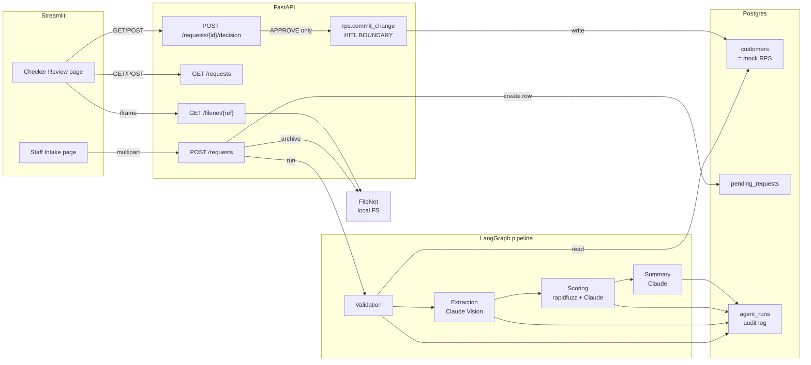

# IASW — Intelligent Account Servicing Workflow

An agentic AI prototype that automates the **Maker** role for core-banking
account change requests — document verification, structured field
extraction, confidence scoring, and human-readable review summary —
while preserving a human **Checker** as the only authority that can
commit a change to the (mocked) core banking system.

The full solution design write-up lives in [`docs/solution-design.md`](docs/solution-design.md).

## The HITL constraint

The hard requirement of this challenge: **the AI must never write to the
core banking system (RPS) autonomously**. Every approval is explicitly
triggered by a human Checker.

We enforce this at the **import graph**, not just at runtime:

- `app/api/rps.py` contains the only function that mutates the customer record.
- It is imported by exactly one file: `app/api/main.py`.
- Within that file, it is called by exactly one handler: the
  `POST /requests/{id}/decision` endpoint, gated behind `decision == APPROVE`.

`grep "from app.api import rps"` returns exactly one match. That single-line
audit answers the regulator's question: _what code can write to RPS?_

## Architecture



The pipeline is synchronous within an HTTP request. A production deployment
would return a `request_id` immediately and run the pipeline async via a
job queue; this is called out in the design doc as future work.

## Demo flow at a glance

1. **Staff** submits a Legal Name Change request and uploads a Marriage
   Certificate (the synthetic sample is in `samples/marriage_certificate_priya.pdf`).
2. The AI pipeline runs in order:
   - **Validation** — confirms the customer exists in mock RPS.
   - **Extraction** — Claude Vision reads structured fields _and_ three
     forgery heuristics (visual quality, internal consistency, document
     structure) in one call.
   - **Scoring** — deterministic name-match (`rapidfuzz`) feeds Claude as
     a hint; Claude scores five dimensions 0–5 with reasoning;
     `overall_confidence` is aggregated by code-side weights.
   - **Summary** — Claude writes a one-paragraph review for the Checker.
3. The request is staged in `pending_requests` with status
   `AI_VERIFIED_PENDING_HUMAN`. Every agent execution writes one row in
   the `agent_runs` audit table.
4. **Checker** opens the queue, drills into the request: AI summary +
   per-dimension scores on the left, the marriage certificate embedded
   on the right.
5. Checker types a reason and clicks **Approve**. The single audited
   write fires against mock RPS, the request flips to `APPROVED`, and
   the lifecycle is logged.

## Tech stack

| Layer              | Choice                                  | Why                                                                                                                      |
| ------------------ | --------------------------------------- | ------------------------------------------------------------------------------------------------------------------------ |
| Backend            | FastAPI + Uvicorn                       | Async-first, automatic OpenAPI, idiomatic Pydantic integration.                                                          |
| ORM                | SQLAlchemy 2.x (typed `Mapped`)         | Industry standard; the modern typed style reads cleanly and supports static checking.                                    |
| Database           | Postgres 16 (Docker)                    | Production-grade; SQLite fallback supported via `DATABASE_URL`.                                                          |
| LLM                | Claude Sonnet 4.5                       | Strong vision + reasoning; single vendor keeps the codebase clean.                                                       |
| Orchestration      | LangGraph                               | Compiles to a graph object renderable as Mermaid; nodes are plain Python functions, no LLM-wrapper bloat.                |
| OCR                | Claude Vision (no Tesseract / Textract) | One call extracts fields _and_ forgery signals; cheaper and simpler than separate OCR + scoring passes.                  |
| UI                 | Streamlit (multi-page)                  | Fastest path to a usable two-role UI for a prototype; fully replaceable without backend changes.                         |
| Doc store          | Local filesystem (FileNet mock)         | Same store-by-ref interface a real FileNet client exposes; swap is a one-day job.                                        |
| Observability      | structlog (JSON to stdout)              | One-line records with bound `request_id` correlation; pipes into any production aggregator.                              |
| Confidence scoring | `rapidfuzz` + Claude hybrid             | Deterministic comparators for mechanical comparisons; LLM judgment where reasoning is needed; auditable weights in code. |

## Setup

Prerequisites: **Python 3.11+**, **Docker Desktop**, an **Anthropic API key**.

```bash
# 1. Clone + enter
git clone <repo> && cd IASW

# 2. Python venv
python -m venv .venv
.venv\Scripts\activate              # Windows
source .venv/bin/activate           # macOS / Linux
pip install -r requirements.txt

# 3. Secrets
copy .env.example .env              # Windows
cp   .env.example .env              # macOS / Linux
# then open .env and paste your ANTHROPIC_API_KEY

# 4. Database
docker compose up -d                # Postgres on :55432
python -m app.seed                  # creates tables, seeds 4 mock customers
```

## Run

Two processes — open two terminals from the project root:

```bash
# Terminal 1 — backend
uvicorn app.api.main:app --reload --port 8000

# Terminal 2 — UI
streamlit run ui/Home.py
```

Then open:

- Streamlit UI: <http://localhost:8501>
- Auto-generated API docs: <http://localhost:8000/docs>

## Demo

```bash
# Once-off: generate the synthetic Marriage Certificate
python samples/generate_sample_cert.py
```

In the browser:

1. **Staff Intake** → submit with default values (`C001`, `Priya Sharma → Priya Mehta`)
   and upload `samples/marriage_certificate_priya.pdf`.
2. Wait ~10–30s for the pipeline; observe JSON log lines streaming in the uvicorn terminal.
3. **Checker Review** → click **Review** on the queued request, read the AI's
   summary and per-dimension scores, see the certificate embedded on the right.
4. Type a reason, click **✓ Approve & Write to RPS**.
5. Confirm the change in mock RPS:

```bash
python -c "from app.db import SessionLocal; from app.models import Customer; s = SessionLocal(); print(s.get(Customer, 'C001').name); s.close()"
# Expected: Priya Mehta
```

## Project structure

```
IASW/
├── app/                      backend
│   ├── config.py             pydantic-settings: env-driven config
│   ├── db.py                 SQLAlchemy engine + session helper
│   ├── models.py             ORM tables: Customer, PendingRequest, AgentRun
│   ├── schemas.py            Pydantic request/response wire shapes
│   ├── filenet.py            local-FS document store (FileNet mock)
│   ├── observability.py      structlog setup
│   ├── seed.py               drop-and-recreate + insert mock customers
│   ├── agents/               the LangGraph pipeline
│   │   ├── state.py          AgentState TypedDict
│   │   ├── prompts.py        system prompts for the three LLM calls
│   │   ├── nodes.py          validation / extraction / scoring / summary
│   │   └── graph.py          LangGraph wiring + run_pipeline()
│   └── api/
│       ├── main.py           FastAPI app, all five routes
│       └── rps.py            mock RPS write — HITL boundary
├── ui/
│   ├── Home.py               Streamlit landing
│   └── pages/
│       ├── 1_Staff_Intake.py
│       └── 2_Checker_Review.py
├── samples/
│   └── generate_sample_cert.py    synthetic Marriage Certificate generator
├── docs/                     design write-up + architecture diagrams
├── filenet_storage/          local document archive (gitignored)
├── docker-compose.yml        Postgres
├── requirements.txt
├── .env.example              copy to .env and fill in
└── README.md                 (this file)
```

## Design notes

- **Two LLM calls in the pipeline, not three.** Extraction emits structured
  fields _and_ forgery heuristics in one Claude Vision call — the model is
  already looking at the image. Scoring is a separate text-only call.
  Summary is a third Claude call (text only) for the natural-language paragraph.
- **Hybrid scoring.** Name match is computed deterministically via `rapidfuzz`
  (`token_set_ratio`, robust to reordering) and provided to the scoring LLM
  as a hint. Five dimension scores come from Claude. Aggregation to
  `overall_confidence` happens in code so weights are auditable, not buried
  in a prompt.
- **Strict JSON output via in-prompt schemas + temperature=0.** Each prompt
  embeds a literal JSON skeleton. With `temperature=0` and a defensive
  markdown-fence stripper, parsing failures are rare.
- **HITL boundary at the import graph, not just at runtime.** Physical
  separation of `app/api/rps.py` makes "what code can write to RPS?" a
  one-line audit instead of a code-walking exercise.

## Known limitations (prototype scope)

- Forgery detection on synthetic documents is inherently heuristic — the
  prototype demonstrates _where_ the check plugs in and what signal it
  produces, not real-world fraud detection.
- No Alembic migrations; the seed script drops and recreates. Production
  would not.
- No retries / circuit-breakers around LLM calls. Failures fall into the
  AgentRun audit log for diagnosis.
- No authentication on the API or UI. A production deployment would gate
  everything behind SSO + role-based authorisation; Staff vs Checker is a
  real RBAC distinction worth enforcing.
- Only the `LEGAL_NAME` change type is implemented. The dispatch in
  `rps.commit_change` shows the extension shape for the other three
  (`ADDRESS`, `DATE_OF_BIRTH`, `CONTACT_EMAIL`).
- The pipeline is synchronous; a production deployment would return a
  `request_id` immediately and process async via a job queue.

## Repository hygiene

`.env` is gitignored — never commit it. `.env.example` documents the
shape; copy it and fill in your own values. The Anthropic API key is the
most sensitive secret in this project; if it ever leaks, rotate it at
<https://console.anthropic.com>.
