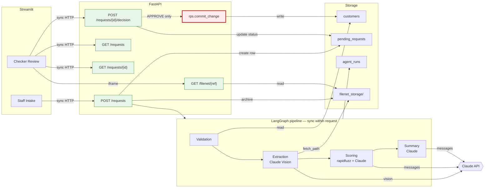
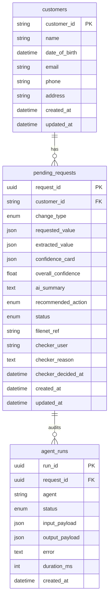
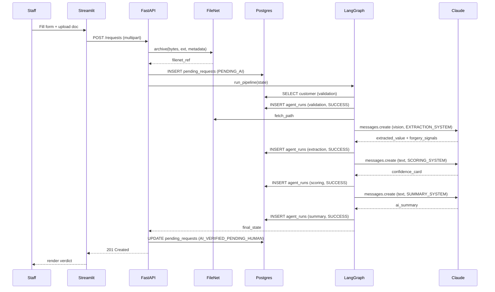
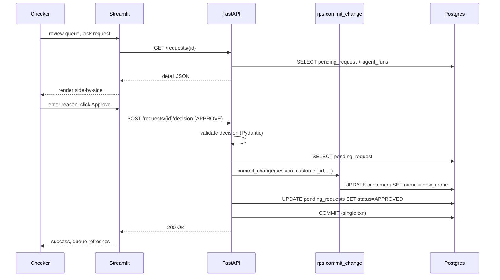

# IASW — Architecture

Technical companion to the [README](../README.md).

This document will help you understand exactly how each component is wired, what it owns,
and where the trade-offs are.

## 1. System overview

Five layers, each with a single, well-defined responsibility:

| Layer                | Responsibility                                                                    | Implementation                  |
| -------------------- | --------------------------------------------------------------------------------- | ------------------------------- |
| **Frontend**         | Capture staff intake; let checker review and decide                               | Streamlit (multi-page)          |
| **API**              | Validate inputs, orchestrate intake, expose checker queue, gate the HITL boundary | FastAPI                         |
| **Agentic pipeline** | Verify the document, score confidence, summarise for human review                 | LangGraph + Claude Sonnet 4.5   |
| **Data**             | Persist canonical Customer (mock RPS), pending requests, per-agent audit          | Postgres 16                     |
| **Document store**   | Archive supporting documents, retrievable by reference                            | Local filesystem (FileNet mock) |

The layers do not bypass each other. The API owns all writes to canonical
tables; agents only write to the audit log.

The HITL boundary lives at a
single Python module (`app/api/rps.py`) imported by exactly one place.

## 2. Component architecture



**Sync vs async.** Every interaction in the prototype is synchronous
within one HTTP request.
For production:

- Intake would return immediately with a `request_id`; the pipeline
  would run in a job queue (Celery / RQ / Temporal).
- The Checker UI would poll `/requests/{id}` for status changes or
  subscribe via WebSocket / SSE.
- Document archival to FileNet would be async-replicated for durability.

## 3. Agent pipeline detail

Four-node LangGraph state machine. Each node receives a shared
`AgentState` dict, performs its job, and returns updates that LangGraph
merges back. The graph is linear; conditional edges are unused for the
prototype (in-node `halt` checks short-circuit).

### 3.1 AgentState

```python
class AgentState(TypedDict, total=False):
    # Inputs (set once by the API before run_pipeline)
    request_id: str
    customer_id: str
    change_type: str
    requested_value: dict
    filenet_ref: str

    # Pipeline outputs (filled in node by node)
    customer_record: Optional[dict]
    extracted_value: Optional[dict]
    forgery_signals: Optional[dict]
    confidence_card: Optional[dict]
    overall_confidence: Optional[float]
    ai_summary: Optional[str]
    recommended_action: Optional[str]

    # Control flow + audit
    halt: Optional[str]
    errors: Annotated[list[dict], operator.add]
```

`errors` uses LangGraph's reducer pattern: each node appends rather than
overwrites. Other fields use the default merge (replace).

### 3.2 Per-node specification

| Node                | Reads                                                                         | External tools                                                          | Writes                                                                    | LLM details                                                                                   |
| ------------------- | ----------------------------------------------------------------------------- | ----------------------------------------------------------------------- | ------------------------------------------------------------------------- | --------------------------------------------------------------------------------------------- |
| **validation_node** | `customer_id`, `change_type`                                                  | Postgres `SELECT customers`                                             | `customer_record` _or_ `halt="CUSTOMER_NOT_FOUND"`                        | none                                                                                          |
| **extraction_node** | `filenet_ref`                                                                 | FileNet (read bytes); Claude Messages API (vision)                      | `extracted_value` (7 fields), `forgery_signals` (3 heuristics × 0–5)      | `claude-sonnet-4-5` · temp 0 · max 2048 · `EXTRACTION_SYSTEM`                                 |
| **scoring_node**    | `requested_value`, `extracted_value`, `customer_record`, `forgery_signals`    | `rapidfuzz.token_set_ratio` (deterministic); Claude Messages API (text) | `confidence_card` (5 dims × 0–5 + reason), `overall_confidence` ∈ [0, 1]  | `claude-sonnet-4-5` · temp 0 · max 1024 · `SCORING_SYSTEM`                                    |
| **summary_node**    | `confidence_card`, `extracted_value`, `requested_value`, `overall_confidence` | Claude Messages API (text); threshold compare (deterministic)           | `ai_summary` (50–100 w), `recommended_action` ∈ {APPROVE, REJECT, REVIEW} | `claude-sonnet-4-5` · temp 0.3 · max 512 · `SUMMARY_SYSTEM` · recommendation in code, not LLM |

### 3.3 Error/Audit trail

Every node writes one `AgentRun` row via the `_agent_run` context
manager (`app/agents/nodes.py`). Each row captures: agent name, status
(SUCCESS / ERROR / SKIPPED), input payload, output payload, error
string if any, duration ms, timestamp.

Example Query - "what did agent X do for request Y?" maps to:

```sql
SELECT * FROM agent_runs WHERE request_id = $1 ORDER BY created_at;
```

### 3.4 Why hybrid scoring

Pure LLM scoring is unreliable for spelling variants (`"Nishaank Rawat"`
vs `"Nishaank S Rawat"` vs `"Rawat, Nishaank"`). Pure deterministic scoring
misses semantic equivalence.

- `rapidfuzz.token_set_ratio` produces a single 0.0–1.0 ratio per name
  pair.
- That ratio is sent to the scoring LLM as a _hint_ alongside the
  request, customer record, extracted fields, and forgery signals.
- The LLM produces a 0–5 score with reasoning that triangulates the
  ratio against context.

Aggregation to `overall_confidence` is a **pure-Python weighted average**
in `_aggregate_overall_confidence`. Weights live in code, not in the
prompt — auditable and tunable in the eval harness without re-prompting.

## 4. Data model



**JSON columns** for `requested_value`, `extracted_value`,
`confidence_card`, `input_payload`, `output_payload`: the shape varies
per change-type or per agent. JSON avoids a wide, mostly-NULL relational
schema. Validation lives at the API boundary in `app.schemas`.

## 5. HITL boundary enforcement

Three layers of enforcement:

**Layer 1 — physical separation.** `app/api/rps.py` is the only file
in the codebase that contains a `customer.<field> = ...` assignment on
the `Customer` ORM model. Future contributors must edit that file to
introduce a new write path; that edit is visible in code review.

**Layer 2 — single import site.** `app/api/main.py` is the only file
that imports from `app/api/rps.py`. `grep -r "from app.api import rps"`
returns one match.

**Layer 3 — single call site.** Within `app/api/main.py`, only the
`decide` handler invokes `rps.commit_change`, and the call is gated:

```python
if body.decision == Decision.APPROVE:
    rps.commit_change(...)
```

Pydantic ensures `body.decision ∈ {APPROVE, REJECT}` (the `Decision`
enum) before the handler runs, so the gate cannot be bypassed by a
malformed input.

**Atomicity.** The customer mutation and the `pending_requests` status
flip happen in the same SQLAlchemy session and commit together:

```python
rps.commit_change(session=db, customer_id=..., ...)  # mutates customer
pending.status = RequestStatus.APPROVED              # flips status
db.commit()                                          # one transaction
```

A crash mid-handler leaves state consistent — the request remains
`AI_VERIFIED_PENDING_HUMAN`, retryable.

## 6. Sequence diagrams

### 6.1 Intake (Staff submits → AI verifies)



### 6.2 Decision (Checker approves → mock RPS write)



## 7. Component responsibility matrix

| Component               | Owns                                                                                                         | Does not own                                           |
| ----------------------- | ------------------------------------------------------------------------------------------------------------ | ------------------------------------------------------ |
| Streamlit UI            | Form rendering, input hints, HTTP orchestration, document iframe embed                                       | Business logic, DB access, LLM calls                   |
| FastAPI                 | Input validation (Pydantic), pipeline orchestration, transaction boundaries, HITL gating, structured logging | Domain logic inside agents, raw LLM prompts            |
| Agents (`app.agents.*`) | Reading the document, calling Claude, scoring math, summary generation, audit row writes                     | API request shape, mock RPS writes, transaction commit |
| `app.api.rps`           | The single mock-RPS write function                                                                           | Anything else                                          |
| Postgres                | Persistence of canonical state and audit trail                                                               | Files (lives in FileNet)                               |
| FileNet (local FS)      | Archived document content + metadata sidecar                                                                 | Any structured pending-request state                   |

## 8. Future work

- **Async pipeline.** Job queue; intake returns request_id immediately.
- **Authentication and RBAC.** SSO + role-gated endpoints (Staff vs Checker)
- **Eval harness.** Golden test cases (good docs, blurry docs, wrong-name docs, off-template docs); regression-tested in CI.

- **Multi-change-type support.** Implement ADDRESS / DATE_OF_BIRTH / CONTACT_EMAIL branches in `rps.commit_change` and corresponding intake form fields.
- **Conditional LangGraph edges.** Replace in-node halt checks with LangGraph conditional edges to skip extraction / scoring / summary on validation halt.
